# 📊 Account Management


Aplicação **fullstack** para gerenciamento de contas financeiras, com autenticação de usuários, dashboard interativo e suporte a tema **light/dark**.

🚀 **Status:** Em produção \
☁️ **Arquitetura:** Serverless (Vercel)

O projeto foi desenvolvido com foco em **Clean Code**, **Single Responsibility Principle (SRP) e arquitetura limpa**, priorizando legibilidade, manutenção e escalabilidade.

🔗 **Live Demo:** https://account-management-j8fjezo7f-the-souzas-projects.vercel.app 

👤 **Acesso:** criação de conta disponível na aplicação \
🧪 **User Demo**
> Use este usuário para testar a aplicação sem criar uma conta.

- Email: user1@example.com
- Senha: 123456

---

## 🖼️ Demonstração

### 📊 Resumo Financeiro
> Visão geral das contas pagas e não pagas com cards, gráfico e tabela interativas.

**Home Page**

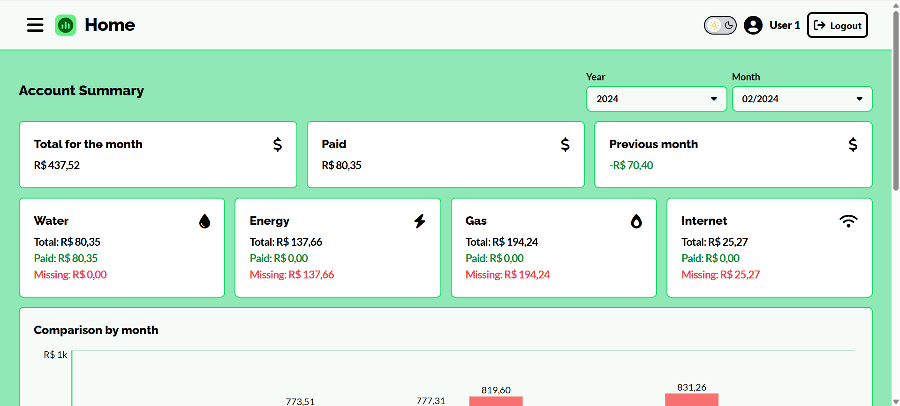 

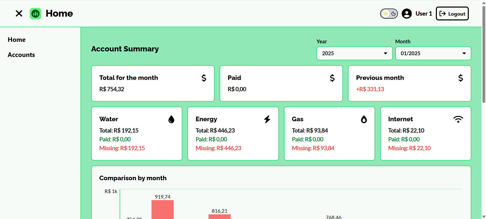 

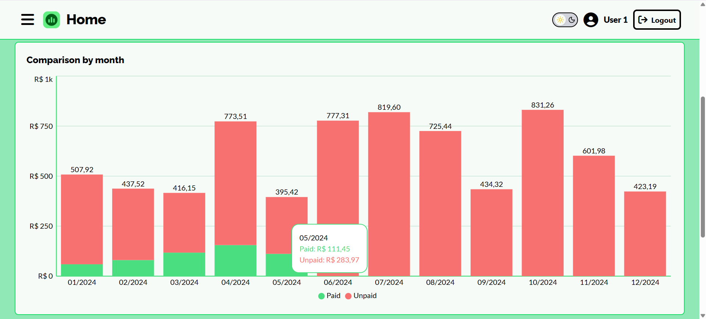

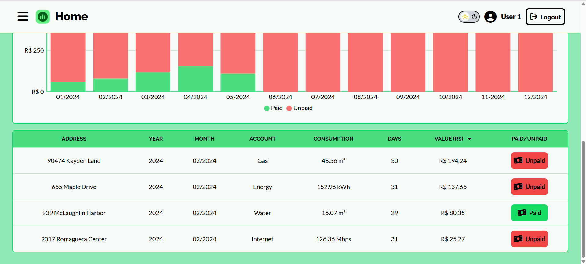 

### 💳 Gerenciamento de Contas
> Tabela com paginação, filtros e ações de edição, deletar e adicionar contas.

**Accounts**


### 🎨 Tema Light / Dark
> Alternância dinâmica de tema com persistência no navegador.

**Home Page**

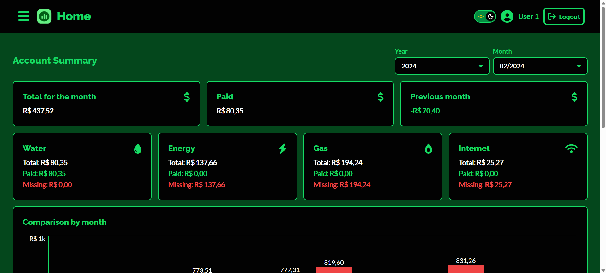

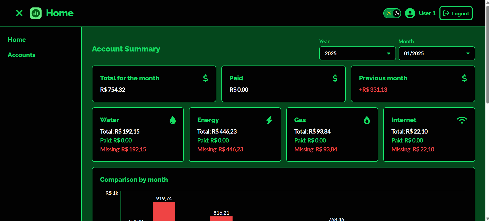 

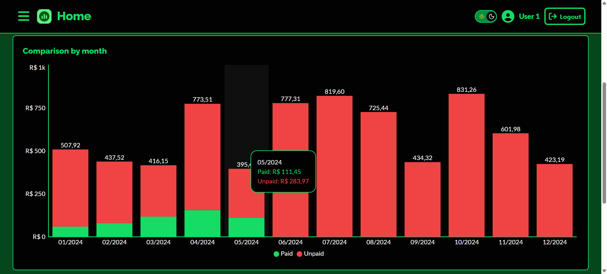

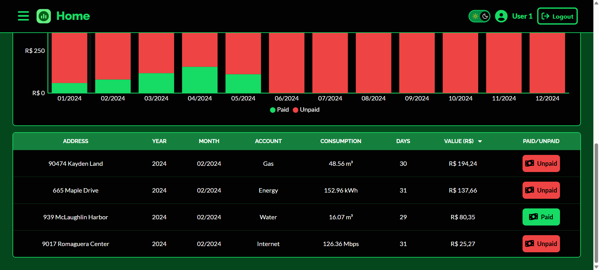

**Accounts**

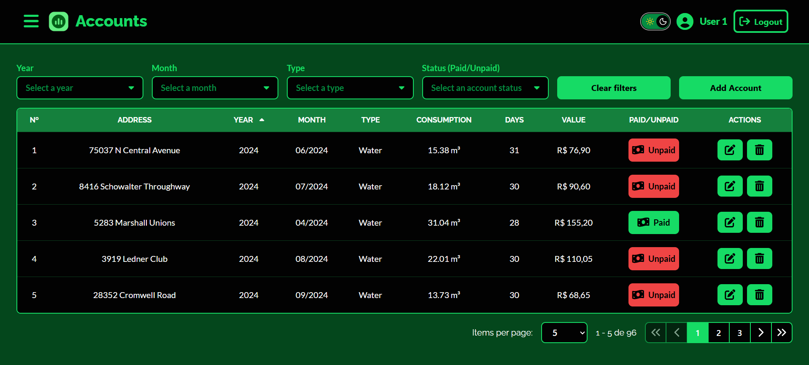 

## 📱 Responsividade (Mobile)

A aplicação foi desenvolvida com abordagem **mobile-first**, garantindo boa
experiência em diferentes tamanhos de tela.

**Home – Mobile**

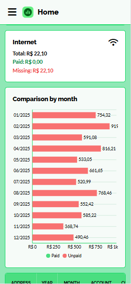

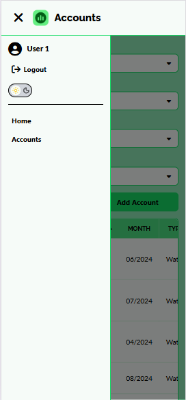

**Accounts – Mobile**

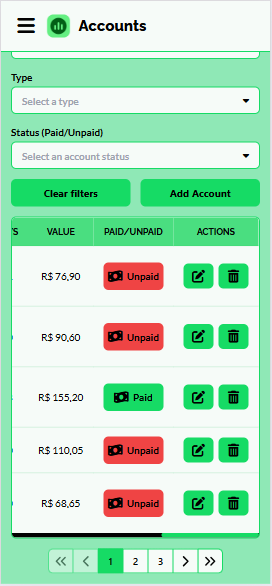


---

## 🚀 Tecnologias Utilizadas

### Core
- TypeScript
- Clean Architecture
- Clean Code / SRP

### Frontend
- React
- Vite
- Tailwind CSS
- Recharts
- React Router DOM
- Context API

### Backend
- Node.js
- Express
- JWT
- Supabase

---

## 🎯 Funcionalidades

### 🔐 Autenticação
- Login, cadastro e reset de senha
- Autenticação baseada em JWT
- Proteção de rotas privadas

### 📊 Dashboard Financeiro
- Gráficos comparativos (Contas pagas x não pagas)
- Resumo financeiro por período
- Layout totalmente responsivo (desktop / mobile)

### 💳 Gerenciamento de Contas
- Cadastro e edição de contas
- Paginação, ordenação e filtros
- Validação de formulários

## 🎨 UI / UX

- Tema Dark / Light
- Componentes reutilizáveis
- Feedback visual com Toasts
- Loading global
- Componentes customizados (Select, Table, Modal, Pagination...)

---

## ☁️ Arquitetura e Deploy

- Backend executado como **Serverless Functions** (Vercel)
- Frontend hospedado na Vercel
- Banco de dados e autenticação via Supabase
- Aplicação stateless, escalável e pronta para crescimento
- Deploy contínuo via GitHub + Vercel

---

## 🧱 Arquitetura

A aplicação segue uma arquitetura em camadas:

- **Controller**: validação e interface HTTP
- **Service**: regras de negócio
- **Provider / Context**: estado global no frontend
- **Hooks**: lógica reutilizável e isolada

Essa separação facilita testes, manutenção e evolução do sistema.

---

## 🗂️ Estrutura do Projeto

> A estrutura foi organizada seguindo princípios de separação de responsabilidades, facilitando manutenção, testes e escalabilidade.

```
Account-Management
├── backend        # API Node.js + Express (Serverless)
│ ├── controllers # Camada HTTP
│ ├── services    # Regras de negócio
│ ├── routes      # Rotas da API
│ ├── middleware  # Autenticação JWT
│ ├── models      # Tipagens e schemas
│ └── utils       # Helpers e utilitários
│
├── src            # Frontend React
│ ├── components  # Componentes reutilizáveis
│ ├── pages       # Páginas da aplicação
│ ├── layouts     # Layouts (Auth / Main)
│ ├── providers   # Context API (Auth, Theme, Toast, Loading)
│ ├── hooks       # Hooks customizados
│ ├── services    # Comunicação com a API
│ ├── styles      # Estilos globais e temas
│ └── utils
│
└── README.md
```

---

## 🎨 Temas (Light / Dark)

O projeto possui suporte completo a temas utilizando:

- Gerenciamento via **ThemeContext**
- Persistência no `localStorage`
- Componentes adaptáveis por tema
- Possibilidade de forçar tema claro em componentes específicos (ex: formulários)

---

## 🔒 Segurança

- Autenticação via JWT
- Middleware para proteção de rotas
- Tokens tratados de forma segura
- Variáveis sensíveis isoladas em `.env`

---

## ⚙️ Configuração do Projeto

### Pré-requisitos
- Node.js (>= 18)
- npm ou yarn
- Conta no Supabase

---

### 🌱 Variáveis de Ambiente

**Backend (`backend/.env`)**
``` 
DATABASE_URL=your_database
SUPABASE_URL=your_url
SUPABASE_ANON_KEY=your_key
SUPABASE_SERVICE_ROLE_KEY=your_key
JWT_SECRET=your_secret
JWT_EXPIRES_IN=your_days
PORT=your_port
```

**Frontend (`.env`)**
```
VITE_API_URL=/api 
``` 

> A URL da API é definida via `proxy` no arquivo `vite.config.ts`.

---

### 💻 Frontend & 🔧 Backend

```bash
npm install
npm run dev
npm run dev:backend
```

---

### 🧪 Scripts de testes

> Os testes validam regras de negócio, autenticação e manipulação de contas, simulando cenários reais com dados mockados.

- `npm run test`

```
========================================
Running Tests
========================================

=== Testing Accounts Services ===

🔹 Testing getAllAccounts()
💾 Total accounts: 192

🔹 Testing getAccountsByUserEmail for user1@example.com
💾 Email accounts user1@example.com: 96

🔹 Marking account ID=3614 as paid...

[Updated account]
{
  id: 3614,
  userId: 32,
  userEmail: undefined,
  address: "5283 Marshall Unions",
  accountType: "Water",
  year: 2024,
  month: "04/2024",
  consumption: 31.04,
  days: 28,
  value: 155.2,
  paid: true
}

✅ Account ID=3614 updated to paid=true!

[Users]
{
  success: true,
  users: [
    {
      id: 32,
      name: "User 1",
      email: "user1@example.com"
    },
    {
      id: 33,
      name: "User 2",
      email: "user2@example.com"
    }
  ]
}

[All Accounts]
[
  {
    id: 3730,
    userId: 33,
    address: "742 E 11th Street",
    accountType: "Water",
    year: 2025,
    month: "12/2025",
    consumption: 16.1,
    days: 28,
    value: 80.5,
    paid: false
  },
  {
    id: 3682,
    userId: 32,
    address: "6749 Veterans Memorial Drive",
    accountType: "Gas",
    year: 2025,
    month: "12/2025",
    consumption: 47.16,
    days: 31,
    value: 188.64,
    paid: false
  }
]
(Showing 2 of 192)

[Email accounts user1@example.com]
[
  {
    id: 3615,
    userId: 32,
    address: "37802 North Lane",
    accountType: "Water",
    year: 2024,
    month: "05/2024",
    consumption: 22.29,
    days: 29,
    value: 111.45,
    paid: false
  },
  {
    id: 3616,
    userId: 32,
    address: "75037 N Central Avenue",
    accountType: "Water",
    year: 2024,
    month: "06/2024",
    consumption: 15.38,
    days: 31,
    value: 76.9,
    paid: false
  }
]
(Showing 2 of 96)

[User accounts test (paid)]
[
  {
    id: 3614,
    userId: 32,
    address: "5283 Marshall Unions",
    accountType: "Water",
    year: 2024,
    month: "04/2024",
    consumption: 31.04,
    days: 28,
    value: 155.2,
    paid: true
  },
  {
    id: 3612,
    userId: 32,
    address: "939 McLaughlin Harbor",
    accountType: "Water",
    year: 2024,
    month: "02/2024",
    consumption: 16.07,
    days: 29,
    value: 80.35,
    paid: true
  }
]
(Showing 2 of 4)

[User accounts test (unpaid)]
[
  {
    id: 3615,
    userId: 32,
    address: "37802 North Lane",
    accountType: "Water",
    year: 2024,
    month: "05/2024",
    consumption: 22.29,
    days: 29,
    value: 111.45,
    paid: false
  },
  {
    id: 3616,
    userId: 32,
    address: "75037 N Central Avenue",
    accountType: "Water",
    year: 2024,
    month: "06/2024",
    consumption: 15.38,
    days: 31,
    value: 76.9,
    paid: false
  }
]
(Showing 2 of 92)

[PATCH response]
{
  success: true
}

✅ Running Tests completed successfully!
```

- `npm run drop:test`

```
========================================
Deleting Test User
========================================

⚠️  Deleting test users and accounts...
✅ Test users and accounts deleted successfully!

✅ Deleting Test User completed successfully!
```

- `npm run seed:test`

```
========================================
Seeding Test Data
========================================

👤 Generating test users...
✅ Users inserted!
💳 Generating test monthly accounts...
✅ Monthly accounts inserted!

✅ Seeding Test Data completed successfully!
```

---

## 🧠 Decisões Técnicas

- Context API escolhida para evitar overengineering com Redux
- Supabase utilizado para acelerar setup de banco e autenticação
- Tailwind CSS para produtividade e padronização visual
- Arquitetura serverless para escalabilidade e menor custo operacional

---

### 📐 Boas Práticas Aplicadas

- Clean Code
- Single Responsibility Principle (SRP)
- Arquitetura em camadas (Controller / Service)
- Componentização reutilizável
- Tipagem forte com TypeScript
- Hooks e Contexts isolados por responsabilidade

---

## 📚 Aprendizados

- Organização de projetos fullstack em monorepo
- Deploy serverless com Vercel
- Gestão de estado global sem Redux
- Criação de componentes altamente reutilizáveis
- Padronização visual com Tailwind e Design Tokens

---

### 📄 Licença

Este projeto está sob a licença MIT. Veja o arquivo LICENSE para mais detalhes.

---

### 👤 Autor

**Guilherme Campos** \
Desenvolvedor Frontend com conhecimentos em Backend